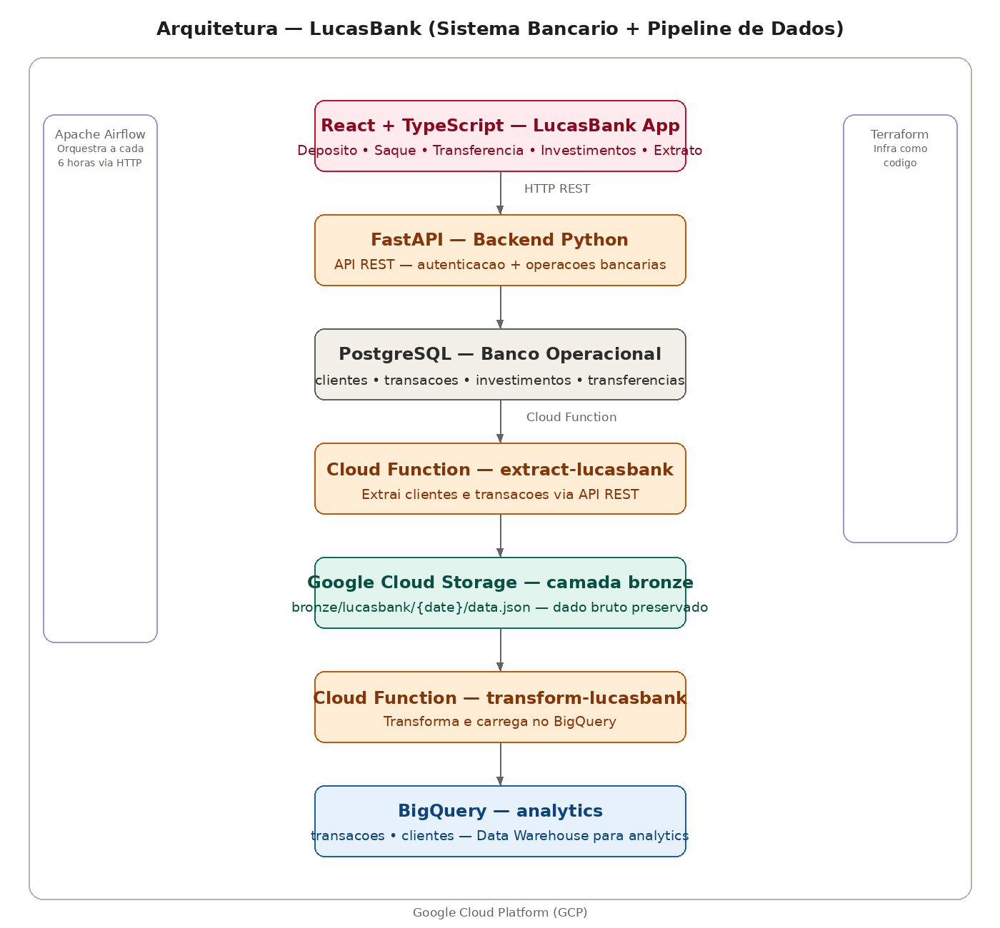

# LucasBank — Sistema Bancário Digital com Pipeline de Dados

Sistema bancário digital completo com frontend React, backend FastAPI, banco de dados PostgreSQL e pipeline de dados que extrai transações e disponibiliza no BigQuery via Cloud Functions e Airflow — arquitetura idêntica à utilizada em fintechs.

## Arquitetura



## Visão geral

O LucasBank simula o fluxo real de dados de uma fintech:

1. Cliente realiza operações no app (depósito, saque, transferência, investimento)
2. Operações são registradas no PostgreSQL (banco operacional)
3. Cloud Function extrai os dados do PostgreSQL via API
4. Dados brutos são salvos no GCS (camada bronze)
5. Segunda Cloud Function transforma e carrega no BigQuery
6. Airflow orquestra todo o pipeline a cada 6 horas

## Arquitetura
## Stack

| Camada | Tecnologia |
|---|---|
| Frontend | React + TypeScript + Vite |
| Backend | Python + FastAPI |
| Banco operacional | PostgreSQL |
| Pipeline | Google Cloud Functions |
| Data Lake | Google Cloud Storage |
| Data Warehouse | BigQuery |
| Orquestração | Apache Airflow |
| Infraestrutura | Terraform |
| Containers | Docker + Docker Compose |

## Funcionalidades do app

- Login por usuário (lucas, ana, joao, yanne)
- Dashboard com saldo em tempo real
- Depósito e saque
- Transferência entre clientes
- Investimentos (CDB, LCI, LCA, Tesouro Direto, Fundos) com aporte e resgate
- Extrato completo com histórico de movimentações

## Clientes cadastrados

| ID | Nome | Login |
|---|---|---|
| 1001 | Lucas Magalhães | lucas |
| 1002 | Ana Luiza | ana |
| 1003 | João Pedro | joao |
| 1004 | Yanne Silva | yanne |

## Queries no BigQuery

```sql
-- Todas as transacoes ordenadas por data
SELECT cliente_nome, tipo, valor, saldo_anterior, saldo_posterior, criado_em
FROM `lucasbank-pipeline.analytics.transacoes`
ORDER BY criado_em DESC;

-- Volume por tipo de transacao
SELECT tipo, COUNT(*) as total, SUM(valor) as volume_total
FROM `lucasbank-pipeline.analytics.transacoes`
GROUP BY tipo
ORDER BY volume_total DESC;

-- Saldo atual de cada cliente
SELECT id, nome, saldo
FROM `lucasbank-pipeline.analytics.clientes`
ORDER BY saldo DESC;

-- Movimentacoes por cliente
SELECT cliente_nome, COUNT(*) as transacoes, SUM(valor) as volume
FROM `lucasbank-pipeline.analytics.transacoes`
GROUP BY cliente_nome
ORDER BY volume DESC;
```

## Como rodar

### 1. Subir o backend e banco de dados
```bash
docker compose up -d
```

### 2. Subir o frontend
```bash
cd frontend
npm run dev
```

### 3. Criar infraestrutura GCP
```bash
cd terraform
terraform init
terraform apply
```

### 4. Deploy das Cloud Functions
```bash
gcloud functions deploy extract-lucasbank \
  --gen2 --runtime=python311 --region=us-central1 \
  --source=pipeline/functions/extract --entry-point=extract_lucasbank \
  --trigger-http --allow-unauthenticated --timeout=120s

gcloud functions deploy transform-lucasbank \
  --gen2 --runtime=python311 --region=us-central1 \
  --source=pipeline/functions/transform --entry-point=transform_lucasbank \
  --trigger-http --allow-unauthenticated --timeout=120s
```

### 5. Subir o Airflow
```bash
cd pipeline/docker
docker compose up airflow-init
docker compose up -d
```

Acesse o Airflow em `http://localhost:8088` e ative a DAG `pipeline_lucasbank`.

## Autor

**Lucas Magalhães** — Engenheiro de Dados

[](https://github.com/lucasmagalhaess)
[](https://linkedin.com/in/lucasmagalhaes-data)
